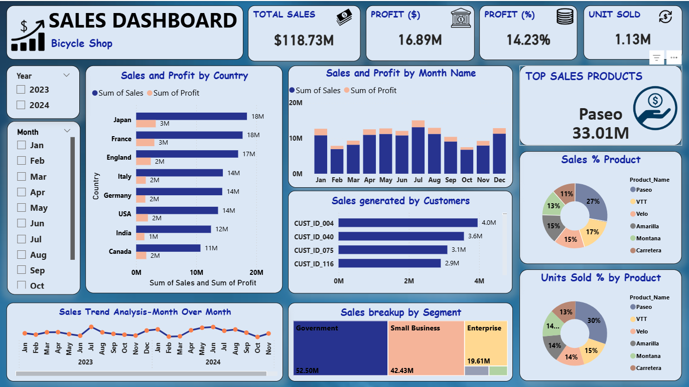

# 🚴 Bicycle Shop Sales Dashboard

A complete interactive **Sales Analytics Dashboard** built to analyze revenue, profit, product performance, customer contribution, and business segments using BI tools.



---

## 📌 Project Overview

This project focuses on building a **Sales Dashboard** for a bicycle shop business to help stakeholders make data-driven decisions. It visualizes sales trends, profitability, top products, country-wise performance, and customer contributions in a single unified view.

---

## 🎯 Objectives

* Track **Total Sales, Profit, Profit % and Units Sold**
* Analyze **Sales & Profit by Country**
* Monitor **Monthly Sales & Profit Trends**
* Identify **Top-Selling Products**
* Understand **Customer Contribution to Sales**
* Analyze **Sales Distribution by Business Segment**
* Visualize **Product-wise Sales % and Units Sold %**

---

## 📊 Dashboard Features

### 🔹 KPI Cards

* Total Sales
* Total Profit
* Profit Percentage
* Units Sold

### 🔹 Filters

* Year filter (2023, 2024)
* Month-wise slicer

### 🔹 Visualizations

* Bar Chart: Sales & Profit by Country
* Column Chart: Sales & Profit by Month
* Line Chart: Month-over-Month Sales Trend
* Donut Charts:

  * Sales % by Product
  * Units Sold % by Product
* Tree Map: Sales breakup by Segment
* Bar Chart: Sales generated by Customers

---

## 🛠 Tools & Technologies Used

* **Power BI** (Dashboard Creation)
* **Excel / CSV** (Data Source)
* **Data Cleaning & Transformation**
* **DAX (Basic Measures)**
* **Data Modeling**

---

## 📂 Dataset Information

The dataset contains:

* Sales data
* Profit data
* Country
* Product Name
* Customer ID
* Segment
* Date (Year, Month)
* Units Sold

---

## 📈 Business Use Case

This dashboard helps:

* Business owners to monitor performance
* Managers to track profit trends
* Sales teams to identify top markets
* Analysts to understand customer behavior
* Companies to optimize product strategy

---

## 🚀 How to Use

1. Download the Power BI file
2. Load dataset
3. Refresh data
4. Use filters for Year and Month
5. Analyze KPIs and trends

---

## 📸 Dashboard Preview

Add the image file in your repo:

```
Bicycle_Shop_Sales_Dashboard.png
```

---

## 📌 Project Highlights

* Professional UI Design
* Clean layout
* Business-focused KPIs
* Interactive filtering
* Corporate dashboard structure
* Real-world business use case

---

## 🧑‍💻 Author

**Sneha Sanap**
Aspiring Data Analyst | Power BI | Python | SQL | Data Visualization


Don’t forget to **star ⭐ the repository** and share it with others!
